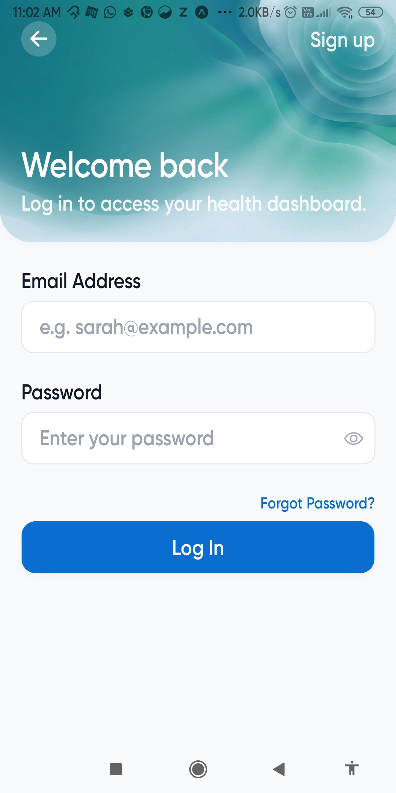
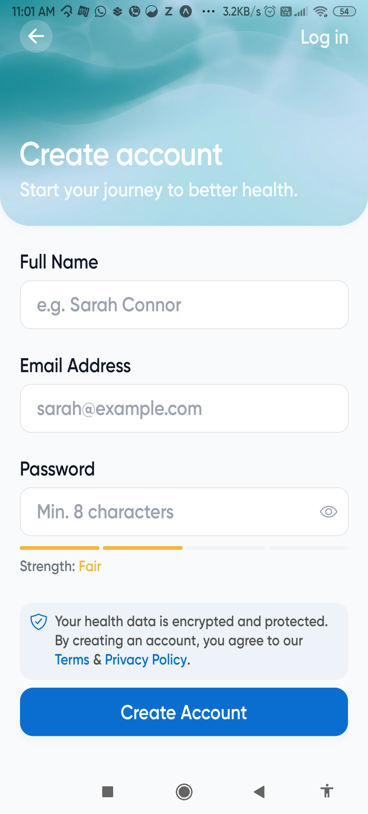
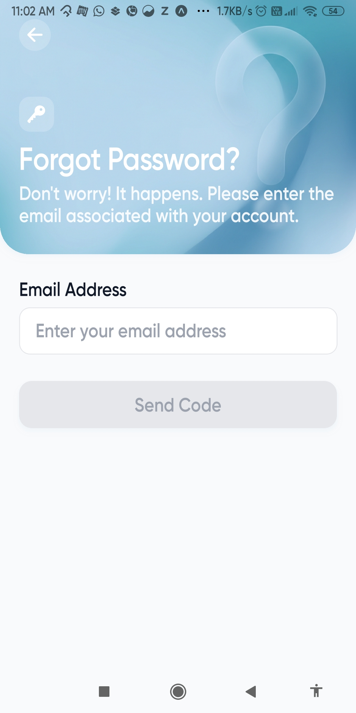
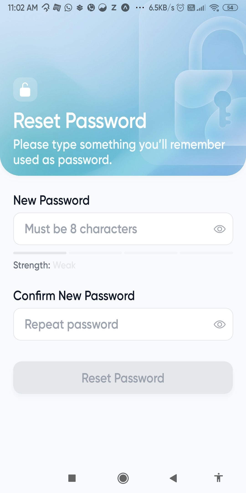
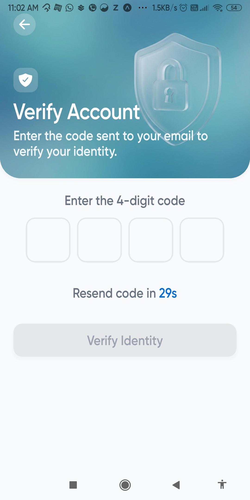
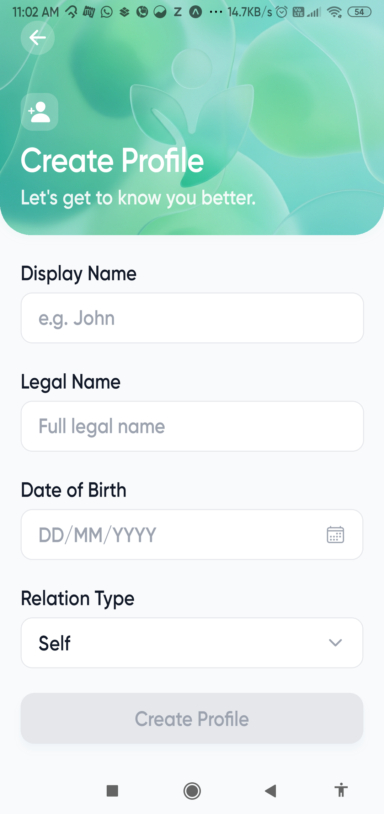

# Health Hub 🏥

**Health Hub** is a secure, multi-profile health data aggregator designed to empower users with ownership of their medical records. It connects directly to healthcare providers (starting with **Epic Systems**) via standard FHIR APIs to fetch, compile, and display comprehensive Electronic Health Records (EHR).

Built with a focus on security, privacy, and user experience, Health Hub allows users to manage profiles for themselves and their dependents in one unified dashboard.

## 🚀 Key Features

-   **Secure Authentication**: Custom auth system with **Redis-backed OTP** (Email) for signup and generic login for returning users.
-   **Multi-Profile Management**: Create and manage distinct profiles (e.g., "Self", "Child", "Parent") to keep medical data organized.
-   **Epic Sandbox Integration**: Full **OAuth 2.0** implementation with PKCE to securely connect profiles to Epic's FHIR APIs.
-   **Aggregated EHR Data**: Fetches and displays:
    -   Patient Demographics
    -   Conditions & Diagnoses
    -   Allergies & Intolerances
    -   Medications (Active & Requested)
    -   Lab Results & Vital Signs (Observations)
    -   Immunizations
    -   Procedures & Encounters
-   **Robust Architecture**: 
    -   **Backend**: Encrypted token storage (AES placeholder), Rate-limited APIs, Centralized Error Handling.
    -   **Background Processing**: **BullMQ** & **Redis** powered job queues for asynchronous data synchronization and profile updates.
    -   **Frontend**: Fault-tolerant data fetching (partial loads supported), Terminal-style raw data viewer.
    -   **Decoupled Sync & Fetch**: Separate pipelines for heavy background syncing and fast, aggregated data retrieval.

## 🛠️ Tech Stack

### Client (Mobile Application)
-   **Framework**: React Native (Expo)
-   **Language**: TypeScript
-   **Styling**: NativeWind (Tailwind CSS)
-   **Routing**: Expo Router
-   **Platform**: iOS & Android

### Server (Backend)
-   **Runtime**: Node.js + Express
-   **Language**: TypeScript
-   **Database**: PostgreSQL (via **Prisma ORM**)
-   **Caching/State**: Redis (for OTPs and OAuth State)
-   **Queues**: BullMQ (for background jobs)
-   **Security**: Helmet, CORS, HPP, Compression

## 📂 Folder Structure

### `client/`
The React Native Expo application.
```text
client/
├── app/                  # Screens & Routing
│   ├── _layout.tsx       # Root Layout
│   ├── index.tsx         # Entry Screen
│   ├── auth/             # Authentication Screens (Login, Signup)
│   ├── home/             # Dashboard & Main Features
│   └── profiles/         # Profile Management
├── src/
│   ├── components/       # Reusable UI Components
│   │   └── ui/           # Atomic Design Elements (Buttons, Inputs)
│   ├── api/              # API Client & Services
│   └── ...
├── assets/               # Static Assets (Images, Fonts)
├── constants/            # App Constants & Theme
├── public/               # Documentation Assets (Screenshots)
└── package.json
```

## 📸 Screenshots

### Auth
| Login | Signup |
|:---:|:---:|
|  |  |

| Forgot Password | Reset Password |
|:---:|:---:|
|  |  |

| Verify |
|:---:|
|  |

### Profile
| Create Profile |
|:---:|
|  |

### Home
*Coming Soon*

### Details
*Coming Soon*

### Future
*Coming Soon*

### `server/`
The Node.js/Express backend API.
```text
server/
├── prisma/               # Database Schema & Migrations
├── src/
│   ├── app/
│   │   ├── controllers/  # Request Handlers
│   │   ├── ehr/          # EHR Integration & Normalization
│   │   │   ├── athena/   # Athena Health Specific Logic
│   │   │   ├── epic/     # Epic Systems Specific Logic
│   │   │   ├── common/   # Shared EHR Utilities
│   │   │   └── ehr.registry.ts
│   │   ├── services/     # Core Business Logic
│   │   │   ├── auth/     # Authentication Service
│   │   │   ├── profile/  # User Profile Management
│   │   │   ├── sync/     # Data Synchronization Logic
│   │   │   └── ...
│   │   ├── middleware/   # Express Middleware (Auth, Error)
│   │   ├── routes/       # API Route Definitions
│   │   ├── sse/          # Server-Sent Events (Real-time)
│   │   └── utils/        # Shared Utilities
│   ├── jobs/             # Background Job Processing
│   │   ├── queues/       # BullMQ Queue Definitions
│   │   └── workers/      # Job Processors
│   ├── config/           # Environment & Configuration
│   ├── database/         # Database Connection (Prisma)
│   ├── redis/            # Redis Connection & Helpers
│   └── index.ts          # Server Entry Point
└── package.json
```

## ⚡ Getting Started

### Prerequisites
-   Node.js (v18+)
-   PostgreSQL
-   Redis
-   An Epic on/off FHIR Sandbox App (Client ID)

### Installation

1.  **Clone the repository**
    ```bash
    git clone https://github.com/shadow-monarch08/Health_Hub.git
    cd Health_Hub
    ```

2.  **Setup Backend**
    ```bash
    cd server
    npm install
    # Create .env file with DB_URL, REDIS_URL, EPIC_CLIENT_ID, etc.
    npx prisma migrate dev
    npm run dev
    # In a separate terminal, to process background jobs:
    npm run worker
    ```

3.  **Setup Frontend**
    ```bash
    cd client
    npm install
    npm run dev
    ```

## 🔐 Security Note
This project uses a standard `Bearer` token implementation for API access. OAuth tokens from Epic are stored in the database. Ensure `PROFILE_ENCRYPTION_KEY` is set in production to encrypt these sensitive tokens at rest.

---
*Built with ❤️ by Q-Labs*
